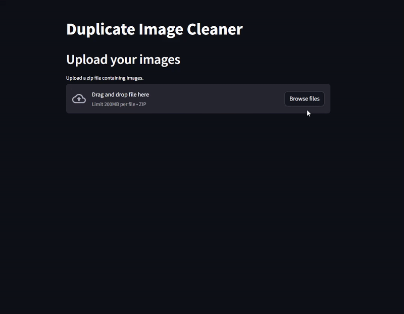

# Duplicate Image Cleaner

A minimalistic app to help you clean up duplicate images.
Upload a ZIP file of images, let the app detect duplicates and similar images, delete unwanted ones, and export your
cleaned-up collection back as a ZIP.

Try the [live demo](https://imagecleaner.streamlit.app/) on Streamlit. 

_You can download and use the demo dataset zip
from [Google Drive](https://drive.google.com/file/d/1bS1Y60WH7zMy2WNtzv9nzy_M3wcCQBrx/view?usp=sharing)._

## Demo

(Click to watch full demo on YouTube)

<a href="https://youtu.be/cUv4FE8ncIw"></a>

## How to Use

1. Upload & Load

   Click on the file uploader to select your ZIP file.
   Click Load File to extract the images.

2. Duplicate Detection & Cleanup
   Click Find Duplicates to detect duplicate groups.
   For each duplicate group (displayed in collapsible sections), you can:
    - Delete the entire group.
    - Delete individual images using the delete buttons under each image.

3. Similar Images

   Choose an image from the dropdown to view its similar images.

4. Export

   Click Prepare Export and then Download Zip to export the cleaned images as a new ZIP file.

## Development guide

1. Clone the Repository

   Clone this project to your local machine.

2. Install Dependencies
    ```bash
    pip install -r requirements.txt
    ```
3. Run the App
    ```bash 
    streamlit run app.py
   ```

4. Generate a Sample Dataset (Optional)

   Open and run the `generate_dataset.ipynb` notebook to download sample images from a Hugging Face dataset into a local
   folder.